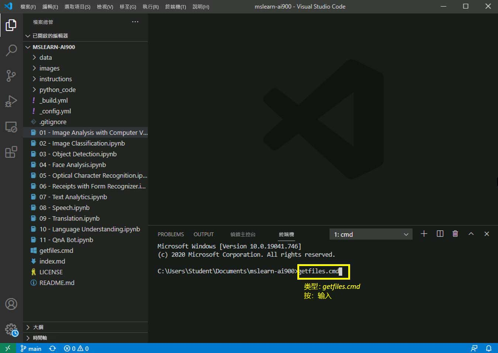

---
lab:
    title: '用表格辨識器分析收據'
---

# 實驗室 AI-900
## 獲取最新檔案

1.  啟動 Visual Studio Code (此程式圖示已固定到底部工作列)。當 Visual Studio Code 開啟時，您會在左側面板看到 MSLEARN-AI900 專案。

2.  我們將提取此專案的最新版本。在開啟終端機中鍵入 [+++getfiles.cmd+++] 並按一下 **[Enter]**。此命令將專案的最新版本提取到您的資料夾中。 
3.  此命令運行後，您就可以關閉終端機面板。現在您可以開始使用實驗室。 

在此實驗室中我們可以使用 Azure 中的表格辨識器服務來識別表單影像中的文字。

-  在 Visual Studio Code 中開啟 **06 - Receipts with Form Recognizer.ipynb** Notebook。 
    **備註：** 您可能會收到提示完成一份 2 分鐘的問卷。繼續並選取 **[不，謝謝]**。您可能需要重複此操作若干次。
-  追隨 Notebook 中的指示以完成實驗室。
